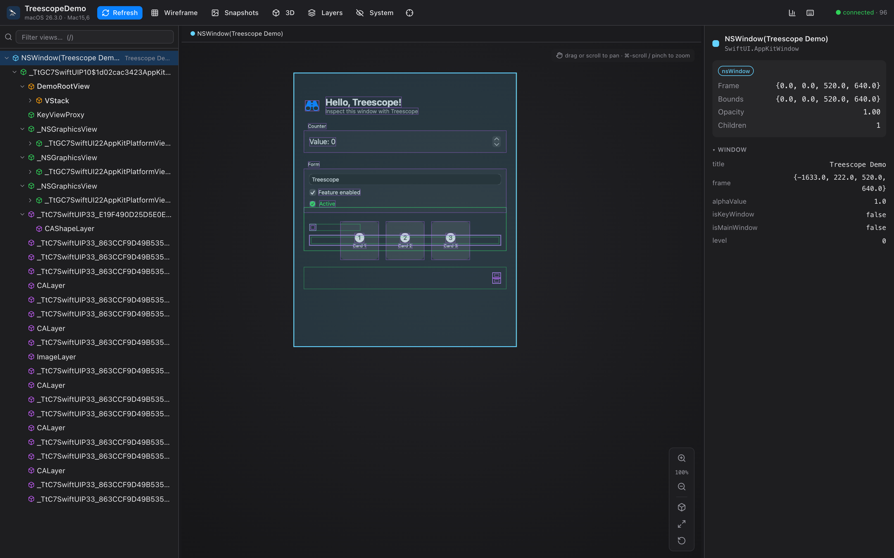
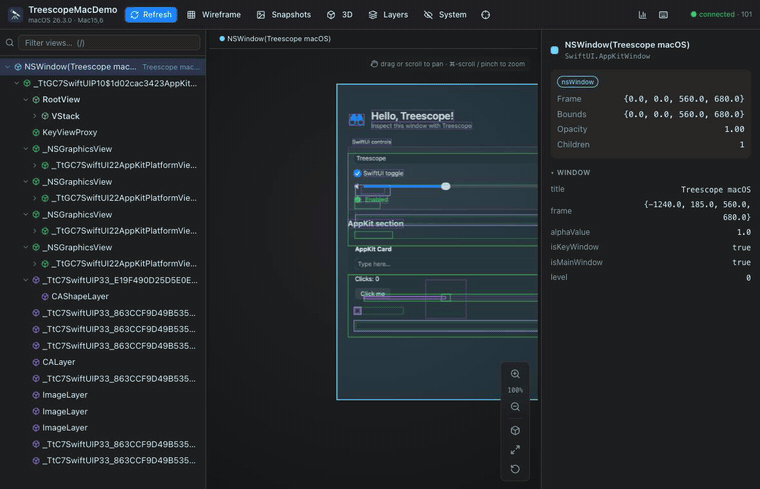

# Treescope

> An open-source runtime **view inspector** for UIKit, AppKit and SwiftUI, viewed in your **browser**.
> A free, open alternative to Lookin — with first-class SwiftUI inspection included.
>
> *Put your view tree under the scope — SwiftUI included.*

<p>
  <a href="https://github.com/everettjf/treescope/actions/workflows/ci.yml"></a>
  <a href="https://everettjf.github.io/treescope/"></a>
  
  
  <a href="LICENSE"></a>
</p>

**🔭 [Website & tutorial →](https://everettjf.github.io/treescope/)**



> **A quick tour** — zoom toward the cursor (⌘-scroll / pinch), drag to pan, and the exploded 3D view:
>
> 

Treescope captures the live view hierarchy of a running iOS/macOS/tvOS app — UIKit, AppKit,
**SwiftUI, and CALayers** — and serves it to a **browser-based viewer** where you can browse the
tree, inspect properties, see frames/snapshots, view an exploded 3D layer view, and edit some
properties live. No app to install: the inspected app hosts the viewer itself over loopback HTTP.

[Lookin](https://github.com/QMUI/LookinServer) is a great open-source inspector, but it's
**UIKit-only**. Treescope adds first-class, fully open **SwiftUI** inspection alongside
UIKit/AppKit and CALayers, and delivers the whole viewer as a zero-install web app.

---

## Why a browser viewer?

- **Zero install, cross-platform.** Anyone opens `http://127.0.0.1:50067` — macOS, Linux, Windows.
  No Xcode, no second app to build.
- **Easy to share.** It's a URL. Screenshots and bug reports just work.
- **Zero dependencies in your app.** The embedded server is a tiny HTTP/1.1 + WebSocket
  implementation built directly on `Network.framework` + `CryptoKit`. Adding Treescope does **not**
  pull Vapor/NIO or anything else into your app.

---

## Components

| Module | Role |
|---|---|
| **`TreescopeProtocol`** | Pure-Foundation shared data model + a clean, discriminated JSON wire contract mirrored by the TypeScript client. |
| **`TreescopeServer`** | The **debug-only runtime** you embed in your app. Captures UIKit/AppKit/SwiftUI/CALayer and serves the viewer + protocol over loopback HTTP + WebSocket. Bundles the built viewer as a resource. |
| **`Web/`** | The browser viewer: React + TypeScript + Tailwind + shadcn/ui. Builds to a single self-contained HTML embedded into `TreescopeServer`. |
| **`CLI/`** | A [command-line client](CLI/README.md) (Node/TypeScript) for inspecting the hierarchy from a shell, script, or **coding agent / LLM** — `treescope tree`, `inspect`, `find`, `snapshot`, `set`, plus an **MCP server** (`treescope mcp`). |
| **`TreescopeDemo`** | A sample SwiftUI app that embeds the server (also runs a self-test probe). |
| **`Examples/TreescopeiOSDemo`** | A real iOS app for Simulator end-to-end testing (UIKit + SwiftUI + keyboard). |
| **`Examples/TreescopeMacDemo`** | A real macOS app adopting the package via SwiftPM (AppKit + SwiftUI + CALayer). |
| **`Archive/`** | The previous native-SwiftUI macOS viewer + client core, kept for reference. Not built. |

Everything is Swift + TypeScript. MIT licensed.

---

## How it works

```
┌─────────────────────────── Your app (Debug build) ───────────────────────────┐
│  TreescopeServer                                                              │
│    • CaptureEngine        walks UIWindow/NSWindow → views → layers            │
│    • SwiftUIReflector     opens `any View`, unwraps ModifiedContent /         │
│                           TupleView / Group / _ConditionalContent, descends   │
│                           custom `body`, reads @State, modifiers, Text…       │
│    • LayerCapture         walks standalone CALayers → resolved geometry       │
│    • HTTPServer           NWListener on 127.0.0.1 (+ Bonjour):                │
│        GET /              → the bundled browser viewer (single HTML)          │
│        GET /snapshot/{id} → a rendered PNG of a node                          │
│        GET /ws            → WebSocket carrying the JSON inspector protocol     │
└───────────────────────────────────┬───────────────────────────────────────────┘
                                     │  loopback HTTP/WS (works for the iOS Simulator)
┌────────────────────────────────────▼──────────────────────────────────────────┐
│  Any browser  →  http://127.0.0.1:50067                                        │
│    Tree outline · Canvas (snapshot + wireframe + exploded 3D) · Inspector      │
└────────────────────────────────────────────────────────────────────────────────┘
```

### SwiftUI inspection

Treescope reflects SwiftUI **without** any private API on the primary path:

- Opens the existential `any View` and inspects the concrete type with `Mirror`.
- Structurally unwraps combinators: `ModifiedContent`, `TupleView`, `Group`, `AnyView`,
  `_ConditionalContent`, `Optional`.
- For **your** views (a real `body`), it descends into `body` to recover the declared tree.
- For framework primitives it scans stored properties to find child views and pulls out
  notable values (e.g. a `Text`'s string, a modifier's parameters, `@State` values).

**Live values.** Once a view is hosted, SwiftUI installs `@State`/`@StateObject`/… onto a live
AttributeGraph location. Treescope reads reference-typed observable state genuinely live: an
`@ObservedObject`/`ObservableObject` model is shared by reference, so its current `@Published`
fields are surfaced and marked `(live)` (a model mutation shows up on the next capture). Value-typed
`@State` on the reflected `rootView` copy isn't graph-backed there, so it shows its declared value.

> **What you get where:** Directly-created hosting views (`UIHostingController` /
> `NSHostingView` — the common "SwiftUI inside a UIKit/AppKit app" case) yield the full
> **declaration** tree (VStack, Text with content, modifiers, `@State`). The CALayer walk gives
> SwiftUI hosting views real *resolved* rendered geometry on the canvas. The one remaining gap: a
> **pure-SwiftUI-lifecycle macOS window root** (`AppKitWindowHostingView`) has an empty `Mirror`,
> so its declaration tree isn't reachable there (the resolved render tree still is).

The whole SwiftUI path uses only public reflection — no `_viewDebugData` / AttributeGraph private
API. (Because the server is **Debug-only**, private API would carry no App Store review risk, but
none is needed.)

---

## Quick start

### 1. Add the server to your app (Debug only)

**Swift Package Manager** — in your `Package.swift`:

```swift
dependencies: [
    .package(url: "https://github.com/xdkhan/treescope.git", exact: "0.1.1-ios13.1"),
],
targets: [
    .target(name: "MyApp", dependencies: [
        .product(name: "TreescopeServer", package: "treescope"),
    ]),
]
```

**Xcode** — *File ▸ Add Package Dependencies…*, paste
`https://github.com/xdkhan/treescope.git`, select `Exact Version` with `0.1.1-ios13.1`, and add
the **TreescopeServer** library to your app target. (This fork supports macOS 13+, iOS 13+,
tvOS 13+.)

Start it once, early, guarded for Debug:

```swift
import TreescopeServer

#if DEBUG
Treescope.start()      // serves http://127.0.0.1:50067 (scans forward if busy)
#endif
```

CocoaPods users: scope the pod to Debug so it is excluded from Release:

```ruby
pod 'Treescope', :configurations => ['Debug']
```

### 2. Open the viewer

Run your app, then open **`http://127.0.0.1:50067`** in any browser.

(For the iOS Simulator, `127.0.0.1` on your Mac reaches the app because the simulator shares the
host network stack.)

### On a physical device

The server listens on `127.0.0.1` only, so on a real iPhone/iPad that loopback is the *device*,
not your Mac. Tunnel it over USB with `iproxy` (from
[libimobiledevice](https://github.com/libimobiledevice/libimobiledevice)) — no app changes needed,
since `iproxy` forwards through usbmuxd to the device's loopback:

```bash
brew install libimobiledevice

# with the device plugged in over USB and the app running:
iproxy 50067 50067           # Mac:50067 → device 127.0.0.1:50067
open http://127.0.0.1:50067  # inspect it from your Mac browser
```

Leave `iproxy` running for the session. If `Treescope.start()` picked a different port (it scans
forward when 50067 is busy — check the log line `listening on http://127.0.0.1:<port>`), forward
that port instead.

### Try it end-to-end

```bash
swift run TreescopeDemo     # a sample app that embeds the server
open http://127.0.0.1:50067 # inspect it in your browser
```

### Inspect from the CLI (or a coding agent)

Prefer the terminal — or want a coding agent / LLM to "see" the UI? The
[`CLI/`](CLI/README.md) package speaks the same protocol as the browser viewer:

```bash
cd CLI && npm install && npm run build
node dist/index.js status               # device info + capabilities
node dist/index.js tree --depth 3       # compact, token-friendly hierarchy
node dist/index.js find LoginButton     # locate a node by name/label/text
node dist/index.js inspect obj:42       # full properties for one node
node dist/index.js --json tree          # machine-readable output for agents
```

For coding agents, `treescope mcp` runs an [MCP](https://modelcontextprotocol.io)
server exposing the inspector as tools (see
[MCP server mode](CLI/README.md#mcp-server-mode)):

```bash
claude mcp add treescope -- node /absolute/path/to/treescope/CLI/dist/index.js mcp
```

---

## Features

- **Unified tree** of UIKit/AppKit views, SwiftUI nodes, and CALayers, colour-coded by framework,
  with search/filter, hide-system-views, keyboard navigation (↑/↓/←/→) and match highlighting.
- **Property inspector** with typed rendering: colours, geometry, booleans, enums, nested values.
- **Live editing** of common properties (alpha/opacity, hidden, cornerRadius, border, background
  colour, text, layer properties…), for views *and* layers.
- **Canvas** with rendered per-node snapshots, frame wireframes, click-to-select, zoom/pan, an
  **exploded 3D** layer view, and hover ↔ tree sync.
- **On-device highlight** of the selected view or layer.
- **Zero-install browser viewer**, served by the app itself.

---

## Building & testing

### Swift package

```bash
swift build            # TreescopeServer + TreescopeDemo (macOS)
swift test             # protocol round-trip, SwiftUI reflector, live-state, AppKit capture,
                       # WebSocket framing, and a real HTTP/WS end-to-end test

# verify the embeddable server compiles for iOS
xcodebuild -scheme TreescopeServer -destination 'generic/platform=iOS Simulator' build
```

There's also a runtime self-probe in the demo (`TREESCOPE_PROBE=1 swift run TreescopeDemo`) and
real, package-adopting example apps with headless WebSocket verifiers under `Examples/` — an iOS
Simulator app (`TreescopeiOSDemo`) and a macOS app (`TreescopeMacDemo`); each has a `./run.sh` that
generates, builds, launches, and verifies end-to-end.

### Browser viewer

The built viewer is committed at `Sources/TreescopeServer/Resources/viewer.html`, so the Swift
package builds out of the box. To rebuild it after changing anything under `Web/`:

```bash
cd Web
npm install
npm run release        # tsc + vite build → single HTML → embed into TreescopeServer
```

---

## Roadmap

- **Pure-SwiftUI-lifecycle macOS window root:** recover the declaration tree from
  `AppKitWindowHostingView` (empty `Mirror`) — the last reflection gap. (Live `@State`/property
  reading for reflectable hosting views is **done**.)
- Measurement guides, snapshot diffing, multi-window switching.

(A built-in USB transport is intentionally **not** pursued — the loopback server already works on a
physical device by forwarding the port with `iproxy` over USB; see
[On a physical device](#on-a-physical-device).)

## License

MIT — see [LICENSE](LICENSE). Built from scratch; no code copied from other inspectors.
